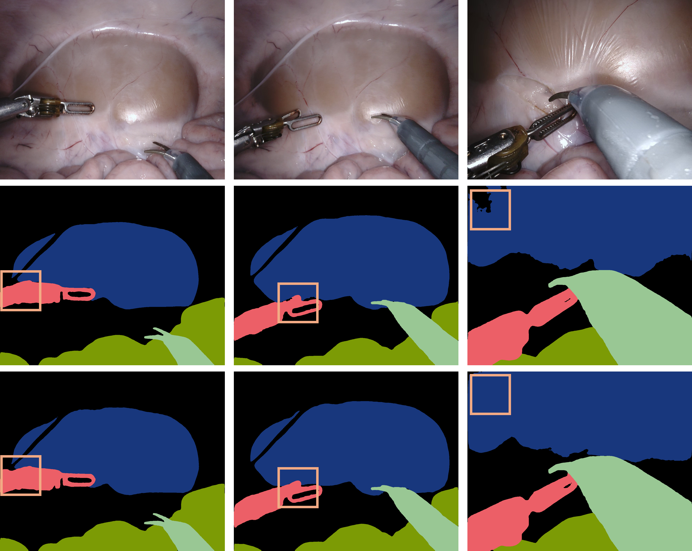

# OASIS

Source code for ICCV-25 paper '[Structure Matters: Revisiting Boundary Refinement in Video Object Segmentation](https://openaccess.thecvf.com/content/ICCV2025/html/Qin_Structure_Matters_Revisiting_Boundary_Refinement_in_Video_Object_Segmentation_ICCV_2025_paper.html)'

## Surgical Demo

### Performance

EndoVis-18 - All Test Videos - Inst. w/ Tis. Segmentation (J&F / J / F) - Zero-Shot

| Methods                |  J&F |    J |    F |
| :---------------- | ---: | ---: | ---: |
| Ours | **74.6** | **76.1** | **73.1** |
| Baseline             | 73.3 | 75.1 | 71.6 |

EndoVis-18 - SEQ 15 - Tissue Segmentation (J&F / J / F) - Zero-Shot

| Obj |                   Ours |              Baseline |
| --: | ---------------------: | --------------------: |
| 011 | **36.5 / 32.7 / 40.2** | 33.2 / 29.8 / 36.6 |
| 012 | **68.0 / 89.3 / 46.7** | 64.2 / 86.9 / 41.5 |
| 017 | **82.3 / 90.4 / 74.1** | 81.2 / 89.6 / 72.8 |

### Visualizations

Figures are arranged in a 2×2 grid: top-left Image, bottom-left GT, top-right Baseline, and bottom-right Ours.

<p align="center">
  
</p>

#### Video

<https://github.com/user-attachments/assets/7b388b10-c486-4ec8-99ea-e5512fdd8a7b>

## Updates

* [10/2025] Repo Release
* [08/2025] Sorry for busy chasing other conferences. The code is now being cleaned and will be make public.
* [07/2025] We released our work 'OASIS', the paper is now on [Arxiv](https://arxiv.org/abs/2507.18944).

## To-Dos

* [X] More checkpoints and results on surgical videos coming in...
* [X] Checkpoints & Pre-computed results...
* [X] Training & Inference Code release
* [X] Initialization

## Dependencies

* Python
* PyTorch

## Instructions

By check the `ckpts/README.md` and finish the download of datasets and image-pretrained ckpts, could leverage the `train.sh` to start model training. Note that u may want to activate the environment before run the script.

```bash
CUDA_VISIBLE_DEVICES=0,1,2,3 OMP_NUM_THREADS=4 torchrun \
--master_port 12345 \
--nproc_per_node=4 \
oasis/train.py \
exp_id=main_small \
model=small \ # Model size/version
data=davis # Training datasets
```

## Citing OASIS

If you find this project helpful in your research, please consider citing our papers:

```text
@inproceedings{qin2025structure,
  title={Structure Matters: Revisiting Boundary Refinement in Video Object Segmentation},
  author={Qin, Guanyi and Wang, Ziyue and Shen, Daiyun and Liu, Haofeng and Zhou, Hantao and Wu, Junde and Hu, Runze and Jin, Yueming},
  booktitle={Proceedings of the IEEE/CVF International Conference on Computer Vision (ICCV)},
  month={October},
  year={2025}
}
```

## Acknowledgement

We borrowed some parts from the following open-source projects:

* [Cutie](https://github.com/hkchengrex/Cutie)

Special thanks to them.
